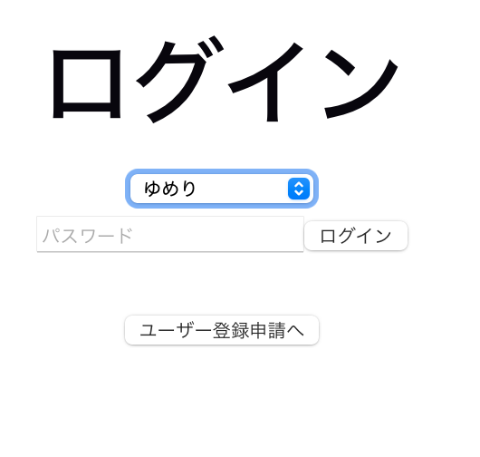
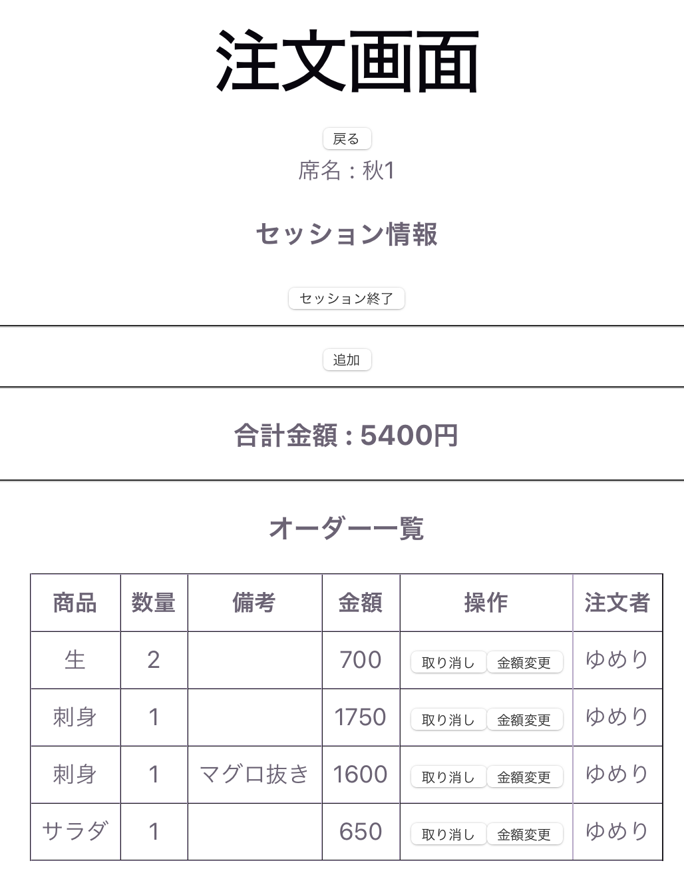

# 飲食店向け・オーダー管理システム

飲食店の業務を効率化するためのWebアプリケーションです。  
注文管理・席管理などを一元化しています。

社員との話合いも行い、実際に店舗に導入し、運用する予定です。

---

## 技術スタック

- Frontend: JavaScript React
- Backend: Python FastAPI
- Database: PostgreSQL
- Authentication: JWT
- ORM: SQLAlchemy

---

## 機能一覧

### ユーザー機能
- ユーザー登録申請
- 登録申請の許可　/ 却下
- ログイン / ログアウト（JWT認証）
- 権限制御（管理者 / スタッフ）

### 業務関連
- カテゴリー、メニュー一覧表示
- 注文登録・変更・削除
- 注文情報の確認
- 席の状態（使用中・空席など）を確認
- 合計金額を取得

↓（管理者機能）
- 席の設定・管理
- メニューの設定
- 全体の注文一覧

---

## 工夫した点

- REST API設計を意識してエンドポイントを整理
- JWT認証によるログイン機能を実装
- 管理者とスタッフで使える機能を制限
- フロントとバックエンドを分離した構成
- スタッフや社員にヒアリングをし、使いやすい設計・UIを意識

---

## スクリーンショット

- ログイン画面
- 登録申請画面

  
  

- 管理者画面
- 席ごとの注文管理画面
- 注文一覧画面

  
  

  

