# 飲食店向け・オーダー管理システム

アルバイト先の飲食店の業務を効率化するためのWebアプリケーションです。  
注文管理・席管理などを一元化しています。

社員との話合いも行い、実際に店舗に導入し、運用する予定です。

---

## 技術スタック

- Frontend: JavaScript React
- Backend: Python FastAPI
- Database: PostgreSQL
- Authentication: JWT
- ORM: SQLAlchemy
- websocket

---

## 機能一覧

### ユーザー機能
- ユーザー登録申請
- 登録申請の許可　/ 却下
- ログイン / ログアウト（JWT認証）
- 権限制御（管理者 / スタッフ）

### 業務関連
- カテゴリー、メニュー一覧表示
- 注文登録・変更・削除
- 注文情報の確認
- 席の状態（使用中・空席など）を確認
- 日本酒の情報を閲覧
- 合計金額を取得

↓（管理者機能）
- 注文の削除・金額変更
- 会計
- 席の設定・管理
- メニューの設定・管理
- 日本酒情報の設定・管理
- ユーザーの管理

---

## 工夫した点

- JWT認証を用いたログイン機能を実装し、安全な認証・認可を実現
- 管理者とスタッフで利用できる機能を制限し、権限管理を実装
- データベースに保存する情報を必要最小限に抑え、保守性を考慮
- バックエンドとフロントエンド間でやり取りするデータを整理し、API設計を最適化
- モジュール間の依存を抑えた疎結合な設計を採用
- 機能追加や仕様変更に対応しやすい拡張性の高い設計を意識
- スタッフや社員へのヒアリングを行い、現場で使いやすいUI・操作性を追求

---

## 詳細

- ログイン画面

登録されているユーザーから、ログインするユーザーを選択し、パスワードを入力することでログインできます。

  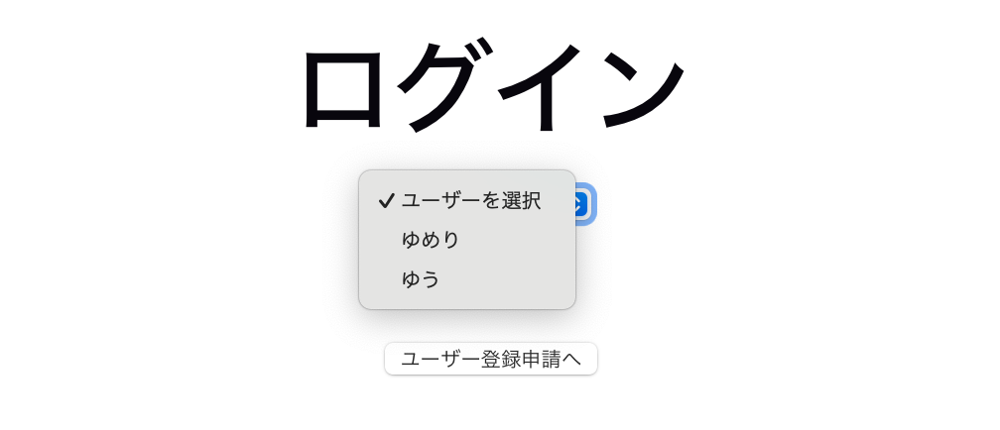
  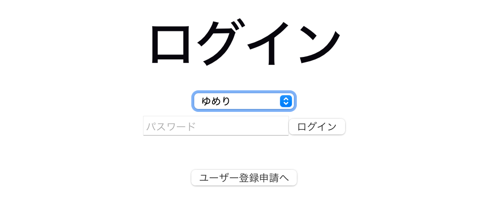

- ユーザー登録申請

ユーザー名とパスワードを設定して、ユーザー登録申請を行うことができます。  
この時点では、管理者に登録申請が送信されるだけで、実際に登録はされません。

  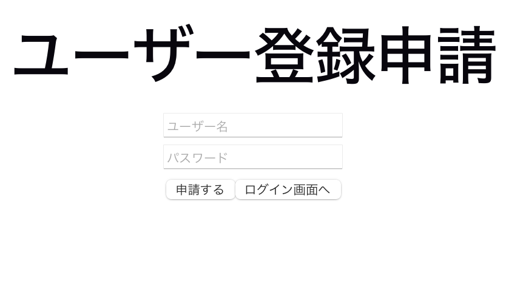

- 管理者画面・スタッフ画面

基本的な機能は「注文」「席の状態確認」「日本酒情報の閲覧」です。  
管理者は、これらの機能に加えて「売り上げ表閲覧」「メニュー設定」「席の設定」「スタッフ設定」「ユーザー登録申請の処理」  
といった機能があります。

<table>
  <tr>
    <td valign="top">
      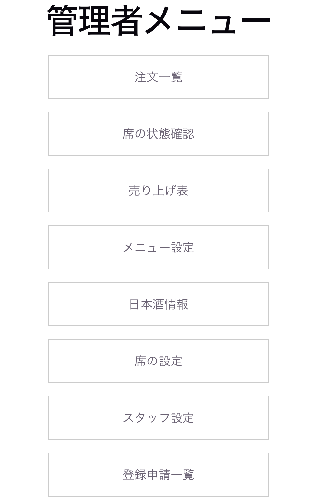
    </td>
    <td valign="top">
      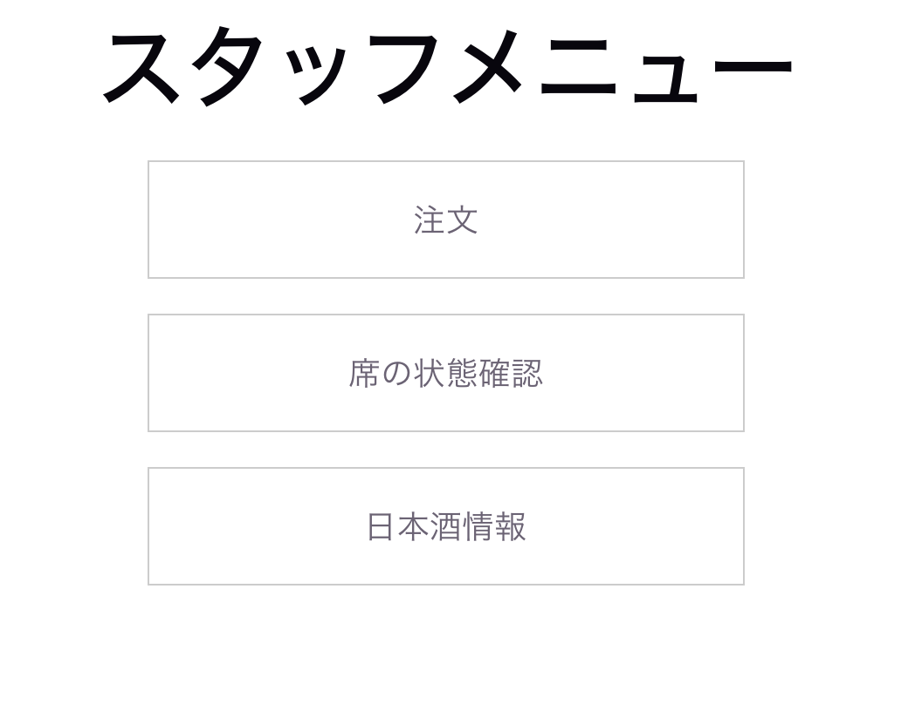
    </td>
  </tr>
</table>

- 注文一覧

席ごとに注文一覧が表示されます。  
この画面はキッチンに表示する用で、ドリンクの注文は表示されないようになっています。  
また、提供済みの注文には線を引くことができます。

  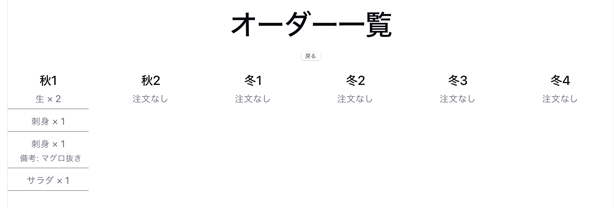

- 注文画面

席ごとに注文を送信することができます。  
管理者機能として、「金額変更」「注文の取り消し」「会計（セッション終了）」ができます。

  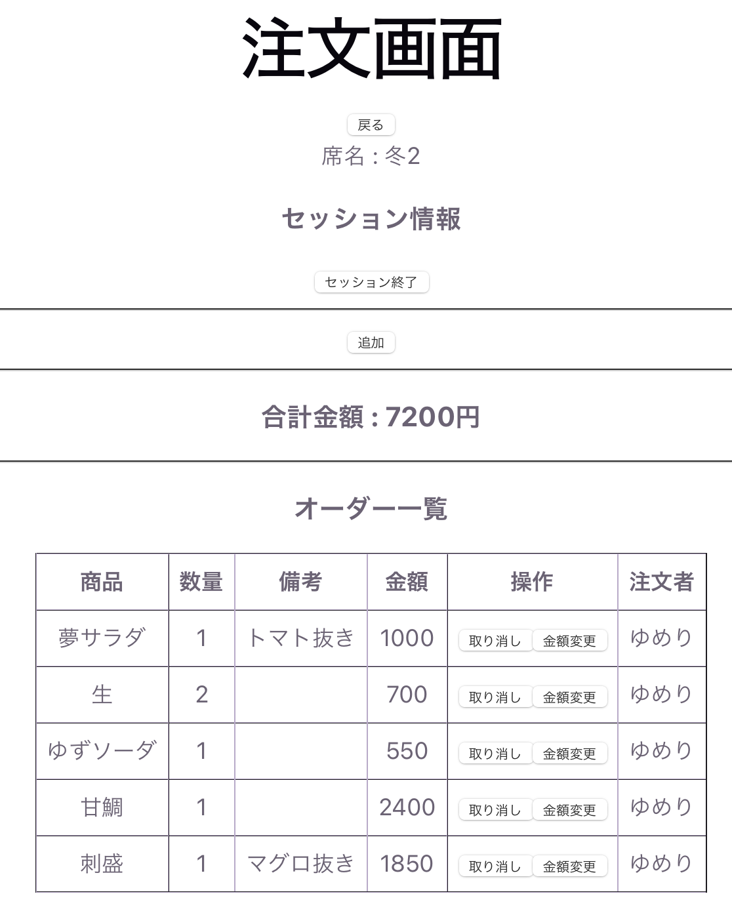

  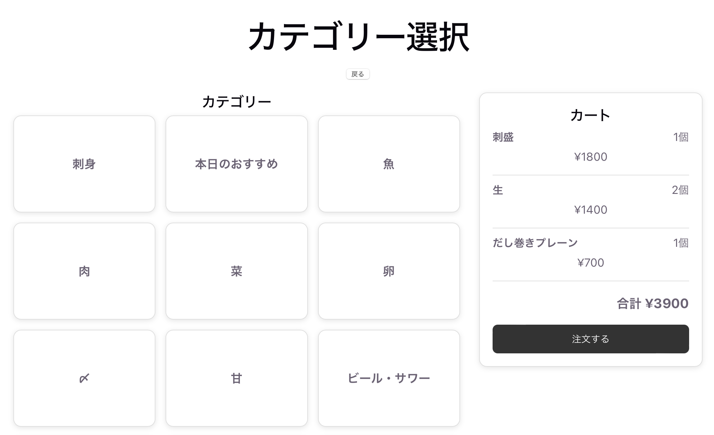
  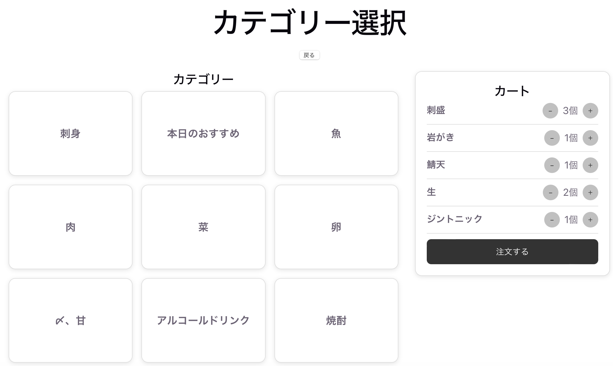

なお、金額が設定されていない注文がある場合、合計金額の取得や会計はできないようになっています。

  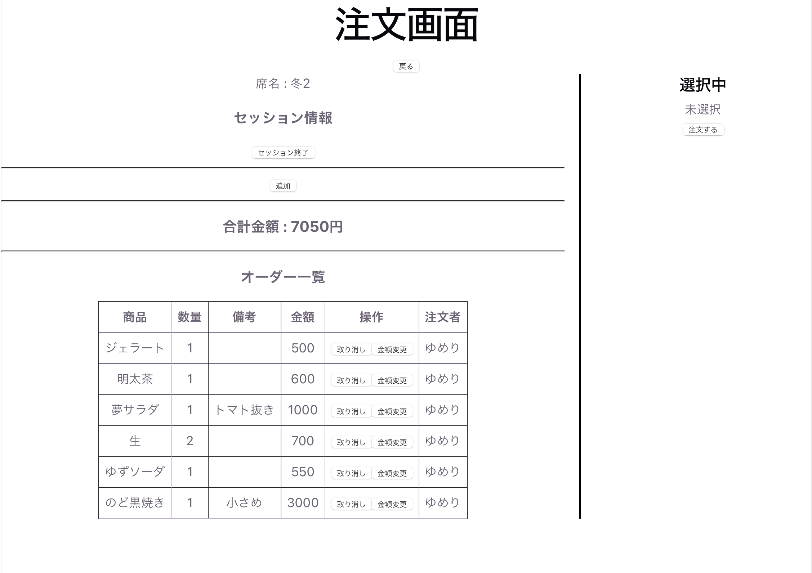

- 席の状態確認

現在の席の状態を確認、更新できます。  
項目は「セット完了」「空席（セットまだ）」「使用中」の３つです。

  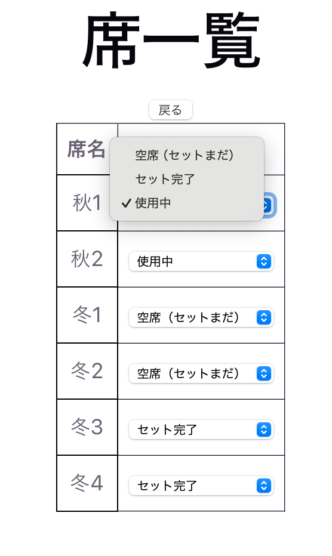

- 売り上げ表（管理者機能）

日付ごとの総売り上げを閲覧することができます。

  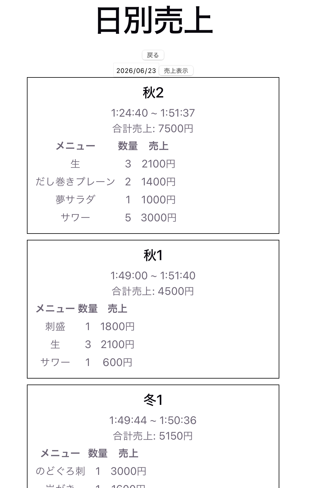

- メニュー設定・管理（管理者機能）

  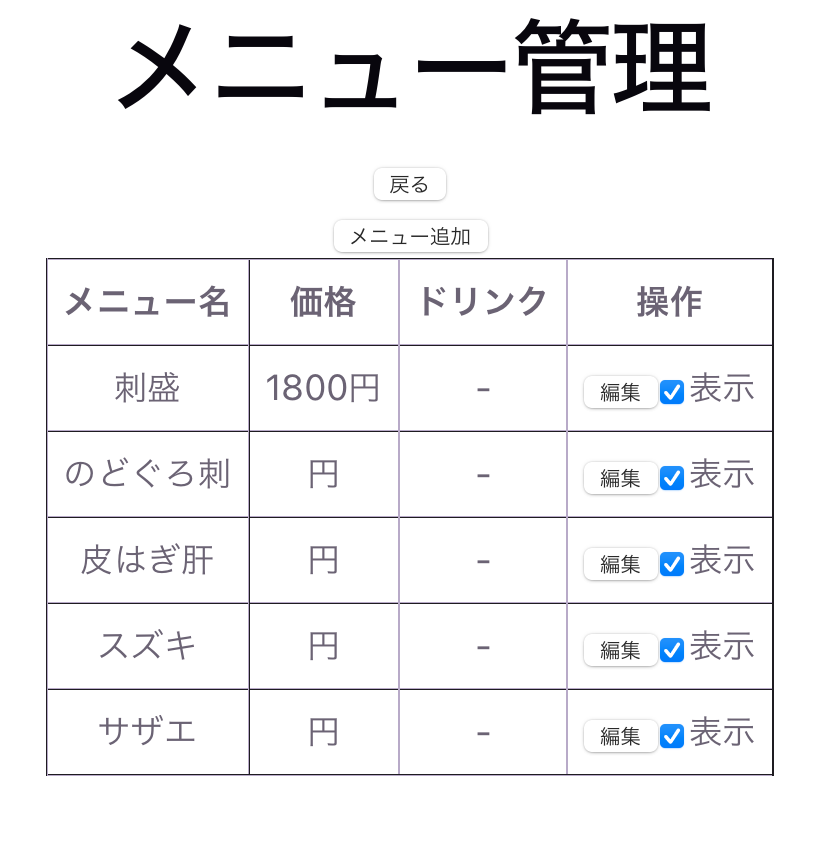
  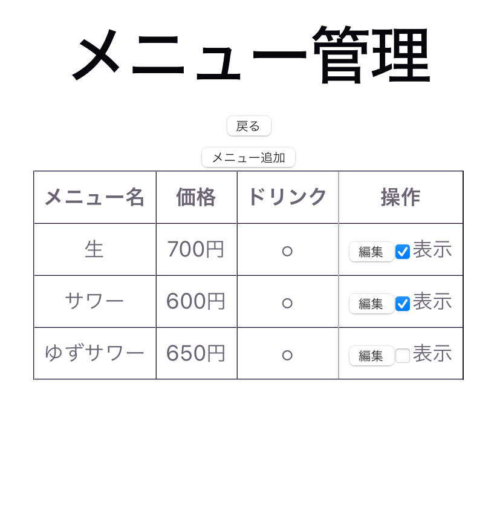

- 日本酒情報

  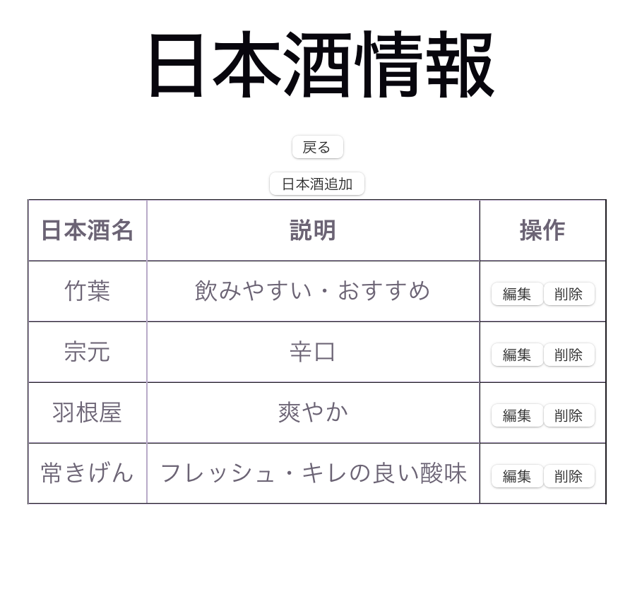

- スタッフ管理（管理者機能）

  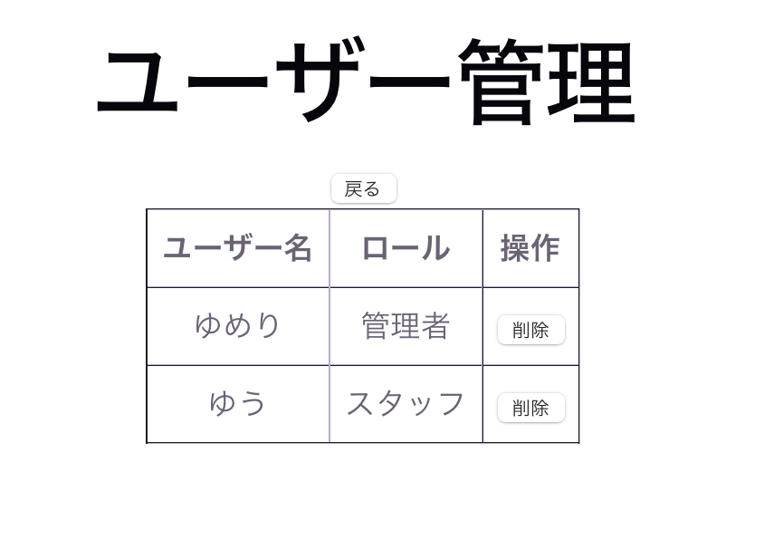

- 登録申請の許可・却下（管理者機能）

管理者がユーザー登録申請を許可した場合飲み、そのユーザーが登録されます。

  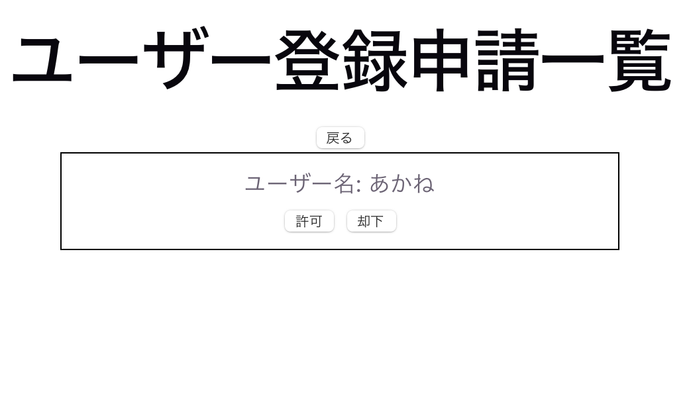

