# 飲食店向けオーダー管理システム

飲食店における注文伝達や席管理を効率化するためのWebアプリケーションである。
注文、提供状況、席、メニュー、売上、スタッフ情報などを一元管理できる。

実際の店舗業務を想定し、スタッフや社員へのヒアリングをもとに設計・開発している。PCだけでなく、スマートフォンやタブレットからも利用できる。

---

## 開発背景

アルバイト先の店舗では紙の伝票で注文を管理しており、2階で受けた注文を口頭で1階へ伝える必要があった。そのため、繁忙時には注文伝達の遅れや伝達漏れが発生していた。

原因の一つは、注文情報をリアルタイムに共有できる仕組みがないことだと考え、業務改善を目的として本システムの開発に取り組んだ。

開発にあたっては、スタッフや社員へのヒアリングを行い、「現場にあると便利な機能」と「店舗運営に必要な機能」を整理した。その内容をもとに、注文の即時共有、一覧表示、操作手順の簡略化などを実装している。

---

## システムの特徴

- 注文内容を席ごとにまとめ、キッチン向け画面へリアルタイムに共有
- 新規注文をWeb Pushで通知し、アプリを開いていない場合も確認可能
- 注文から提供状況、会計までを一つのシステムで管理
- 管理者とスタッフの権限に応じて利用できる機能を制御
- PWAとしてホーム画面に追加でき、スマートフォンやタブレットでも操作可能
- 画面サイズや向きに応じて表示を調整するレスポンシブUI

---

## 技術スタック

- **Frontend:** JavaScript / React / React Router / Axios / Vite
  コンポーネント単位で画面を構築でき、再利用性や保守性の高いUIを実現しやすいため採用した。状態管理による動的な画面更新にも適している。

- **Backend:** Python / FastAPI / Uvicorn
  API開発を効率的に進められることに加え、型ヒントや自動生成されるAPIドキュメントを利用できるため採用した。

- **Database:** PostgreSQL / SQLAlchemy
  複数端末からの利用を想定し、同時アクセス性能と拡張性を考慮して採用した。

- **Authentication:** JWT / Passlib / bcrypt
- **Realtime:** WebSocket
- **Notification:** Web Push / Service Worker / VAPID
- **PWA:** vite-plugin-pwa / Workbox

---

## 機能一覧

### 認証・ユーザー管理

- ユーザー登録申請
- 管理者による登録申請の許可・却下
- ログイン / ログアウト（JWT認証）
- 権限制御（管理者 / スタッフ）
- 管理者によるユーザー一覧の確認・削除

### 注文・キッチン業務

- 席ごとの注文セッション開始・終了（会計）
- カテゴリーとメニューから商品を選択し、カートへ追加
- 注文数量と備考の入力
- 席ごとの注文内容・注文者・合計金額の確認
- 注文の取り消し・金額変更
- 注文の提供済み / 未提供の切り替え
- キッチン向け注文一覧ではドリンクを除外して表示
- WebSocketによる新規注文のリアルタイム反映
- 通信復帰時や画面再表示時の自動再同期
- Web Pushによる新規注文通知

### 席・商品・売上管理

- 席の状態確認・更新（セット完了 / 空席 / 使用中）
- 席の作成・編集・削除
- カテゴリーの作成・編集・非表示・復元
- メニューの作成・編集・非表示・復元
- 日本酒情報の閲覧・作成・編集・削除
- 日付ごとの注文内容と売上の確認

### UI・モバイル対応

- PWA対応（ホーム画面への追加）
- PC、スマートフォン、タブレットに対応したレスポンシブ表示
- 主要画面へ移動できる下部ナビゲーション
- タブレット横画面における複数席の一覧表示
- モバイル用の注文カート・モーダル表示

---

## 工夫した点

- WebSocketで新規注文を即時反映し、モバイル端末のスリープや回線切り替えで通知を逃した場合も自動再同期する構成にした
- Web Pushを導入し、注文画面を開いていないスタッフにも新規注文を通知できるようにした
- キッチン画面では調理対象となる注文だけを表示し、提供状況をワンタップで変更できるようにした
- 管理者とスタッフで利用可能な操作を分け、バックエンド側でも権限を確認している
- 注文カートの状態を親コンポーネントで管理し、カテゴリー画面とメニュー画面を移動しても選択内容が残るようにした
- 画面幅と向きに応じてUIを切り替え、スマートフォンやタブレットでも操作しやすい表示にした
- API、CRUD、スキーマ、モデルを分離し、機能追加や仕様変更を行いやすい構成にした
- 現場スタッフへのヒアリングを継続し、実際の業務フローに沿った操作性を重視した

---

## システム構成

```text
order_entry_system/
├── backend/
│   └── app/
│       ├── cruds/      # データベース操作
│       ├── models/     # SQLAlchemyモデル
│       ├── routers/    # REST API
│       ├── schemas/    # Pydanticスキーマ
│       ├── utils/      # 認証・通知などの共通処理
│       └── ws/         # WebSocketエンドポイント
└── frontend/
    ├── public/         # PWA・Push通知関連ファイル
    └── src/
        ├── components/ # 共通コンポーネント
        ├── pages/      # 各画面
        └── utils/      # API・通知関連処理
```

---

## ローカル環境での起動

### 1. バックエンド

```bash
cd backend
python -m venv .venv
source .venv/bin/activate
pip install -r requirements.txt
cp .env.example .env
uvicorn app.main:app --reload
```

`.env`には、PostgreSQLの接続先、JWTのシークレットキー、初期管理者情報、CORS許可オリジンを設定する。Web Pushを使用する場合は、VAPID鍵も設定する。

### 2. フロントエンド

```bash
cd frontend
npm install
cp .env.example .env
npm run dev
```

フロントエンドは通常 `http://localhost:5173`、バックエンドは `http://localhost:8000` で起動する。

### 3. 初期管理者の作成

バックエンド起動後、`.env`に設定した情報を使って次のAPIを一度だけ実行する。

```text
POST /init
```

FastAPIのAPIドキュメントは `http://localhost:8000/docs` から確認できる。

---

## 画面・機能紹介

以下は、READMEに掲載するスクリーンショットの構成案である。
画像は `images/` ディレクトリへ配置し、各項目にあるコメント内の `` タグを有効化して追加する。

### 1. ログイン・ユーザー登録申請

IDとパスワードによるログイン画面と、ユーザー登録申請画面を掲載する。
申請したユーザーは、管理者による許可後にログインできる。

<p align="center">
  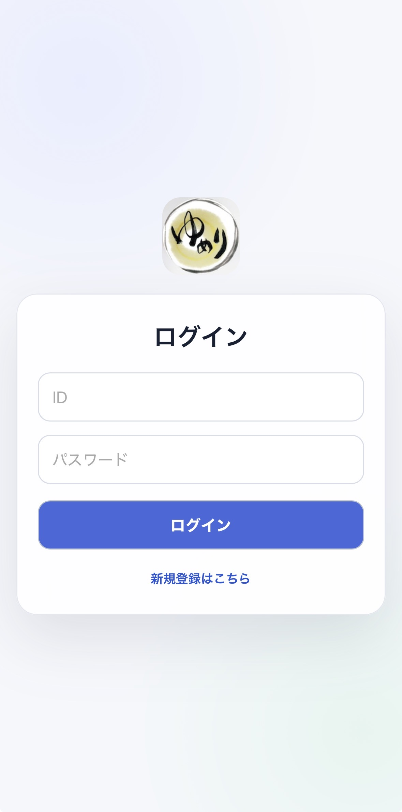
  
</p>

### 2. 管理者・スタッフのメニュー画面

管理者とスタッフで表示される機能が異なることを比較できるよう、2画面を並べて掲載する。

<table>
  <tr>
    <th>管理者画面</th>
    <th>スタッフ画面</th>
  </tr>
  <tr>
    <td>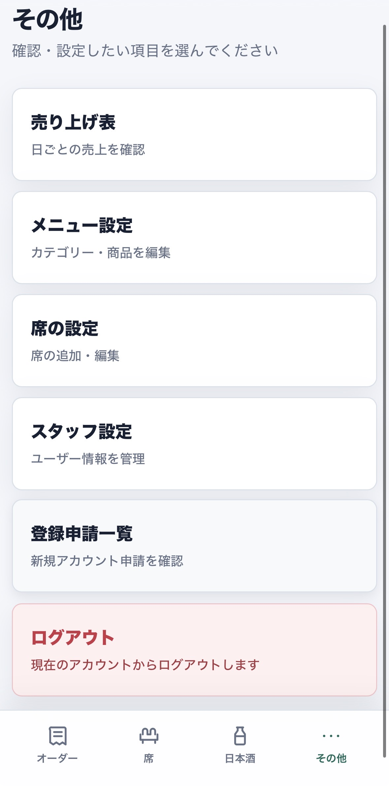</td>
    <td>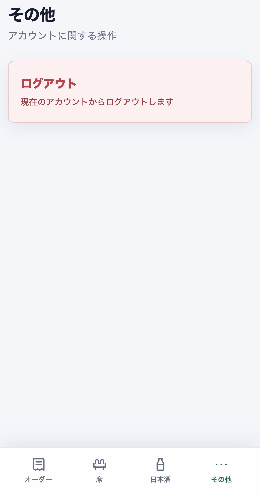</td>
  </tr>
</table>

### 3. キッチン向け注文一覧

席ごとの注文、未提供件数、提供済み表示が分かる画面を掲載する。

<p align="center">
  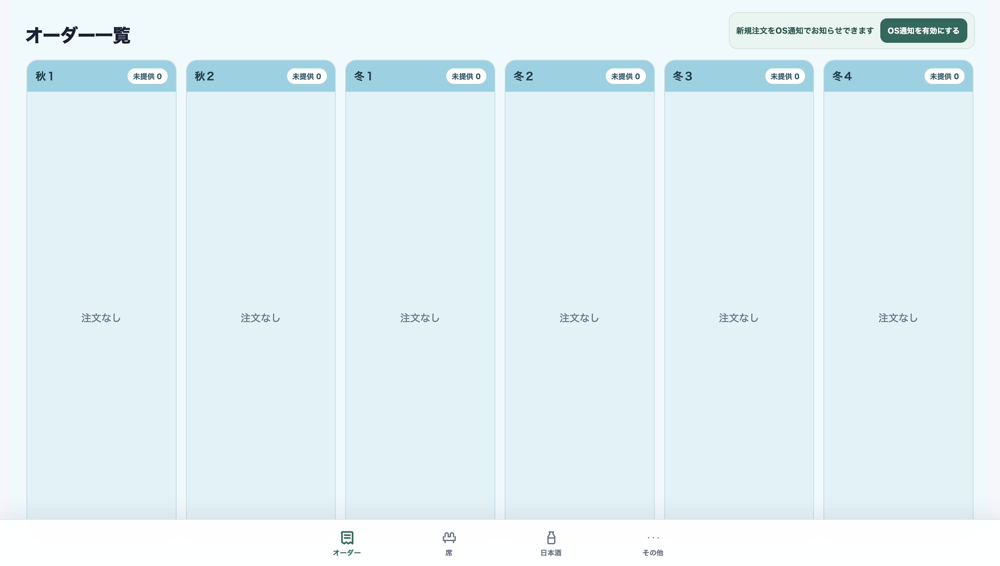
  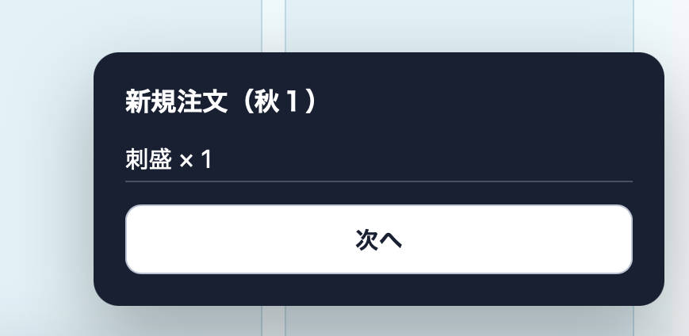
</p>

### 4. 注文の流れ

「席の注文画面 → カテゴリー選択 → メニュー選択 → カート確認」の流れが分かるように掲載する。
数量や備考の入力、合計金額、注文の取り消し、会計機能もこの項目で紹介する。

<p align="center">
  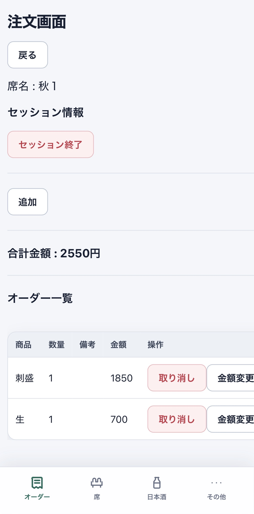
  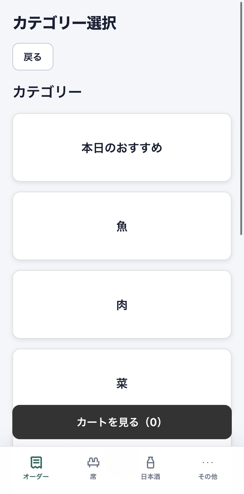
</p>
<p align="center">
  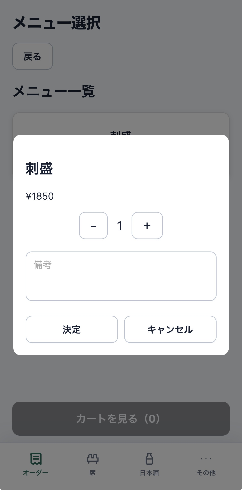
  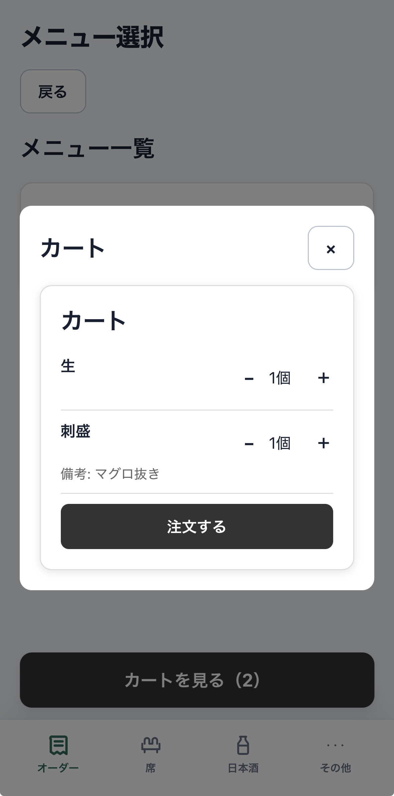
</p>

### 5. モバイル・タブレット表示

スマートフォンの注文カートと、PC画面で複数席を一覧表示した画面を掲載する。

<!-- スクリーンショット枠：レスポンシブUI
<p align="center">
  
  
</p>
-->

### 6. 席の状態管理

「セット完了」「空席（セットまだ）」「使用中」を一覧で確認・更新できる画面を掲載する。

<p align="center">
  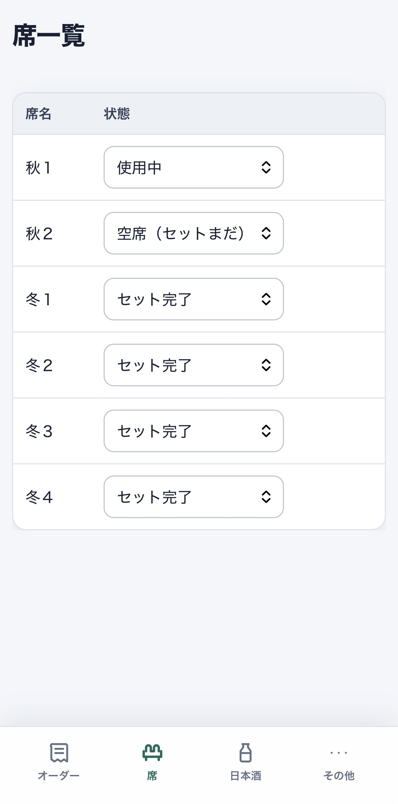
</p>

### 7. カテゴリー・メニュー管理（管理者機能）

カテゴリーとメニューの作成・編集画面を掲載する。
表示・非表示の切り替えや、非表示メニューの復元機能が分かる状態が望ましい。

<p align="center">
  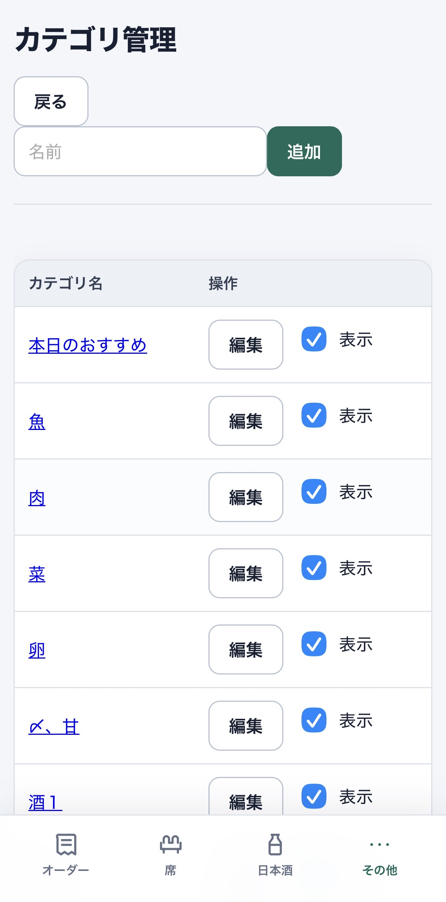
  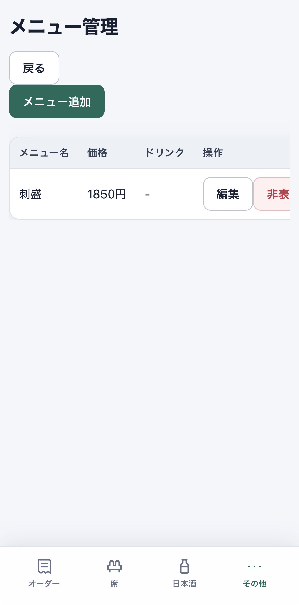
</p>

### 8. 売上確認（管理者機能）

指定した日付の注文内容と総売上を確認できる画面を掲載する。

<p align="center">
  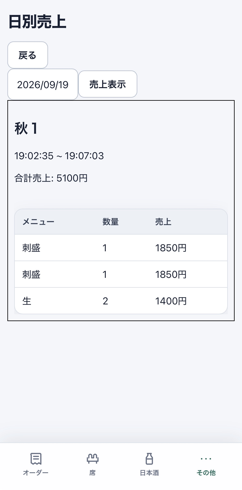
</p>

### 9. 日本酒情報

スタッフ向けの閲覧画面を掲載する。管理者用の編集操作も紹介したい場合は、2画面を並べる。

<p align="center">
  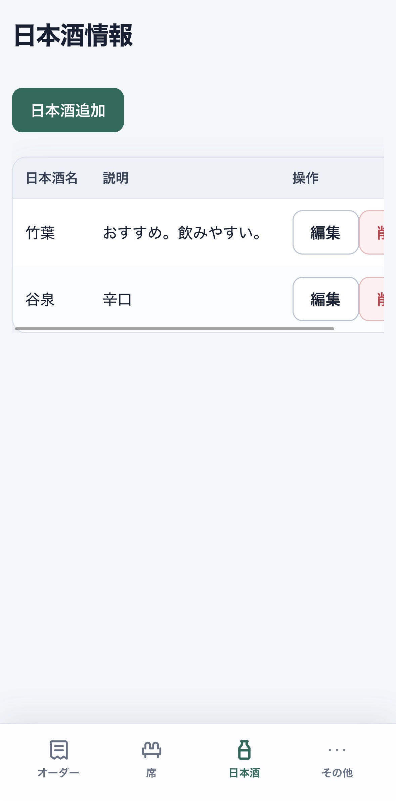
  
</p>

### 10. ユーザー・登録申請管理（管理者機能）

登録済みユーザーの管理画面と、登録申請の許可・却下画面を並べて掲載する。

<p align="center">
  
  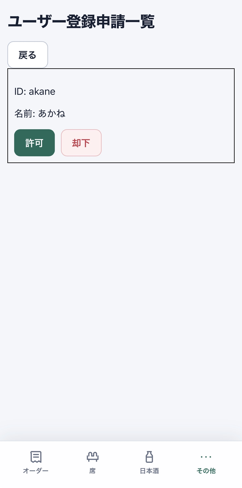
</p>
